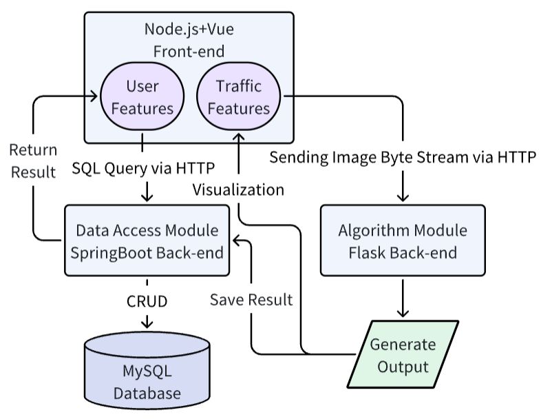

# Traffic Flow Recognition System Front-end

The Front-end of a Traffic Flow Recognition System.

The Traffic Flow Recognition System is build up with three module. One is this Front-end, a Spring Boot [Back-end](https://github.com/DavidZhang0710/x-admin-back/tree/project), and a Flask Back-end to provide algorithm API.

The framework and workflow diagram are as shown in the followed figure.



## Getting Started

These instructions will get you a copy of the project up and running on your local machine for development.

### Prerequisites

Software/Package version requirement:

```
npm <= 8.1.0
node.js <= 16.12.0
```

### Installing

Clone the project and use npm to install dependency

```
# clone the project
git clone -b project https://github.com/DavidZhang0710/x-admin-web.git

# enter the project directory
cd x-admin-web

# install dependency
npm install
```

Here you have a project ready to run.

## Running

First you need to set up the configuration in ```.env.development```, making sure the value of ```VUE_APP_BASE_API``` is your back-end port, and the value of ```VUE_APP_FLASK_API``` is your algorithm API back-end port.
```
# just a flag
ENV = 'development'

# base api
VUE_APP_BASE_API = 'http://localhost:9999'
VUE_APP_FLASK_API = 'http://localhost:9998'
```
Now you can run the project.
```
# develop
npm run dev
```

## Built With

* [Vue.js](https://vuejs.org/) - The web framework used
* [Node.js](https://nodejs.org/) - JavaScript Environment Management
* [Element UI](https://element.eleme.io/) - Used to set up Web UI


## License

This project is licensed under the MIT License - see the [LICENSE](LICENSE) file for details